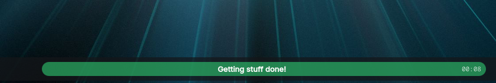
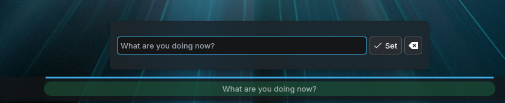
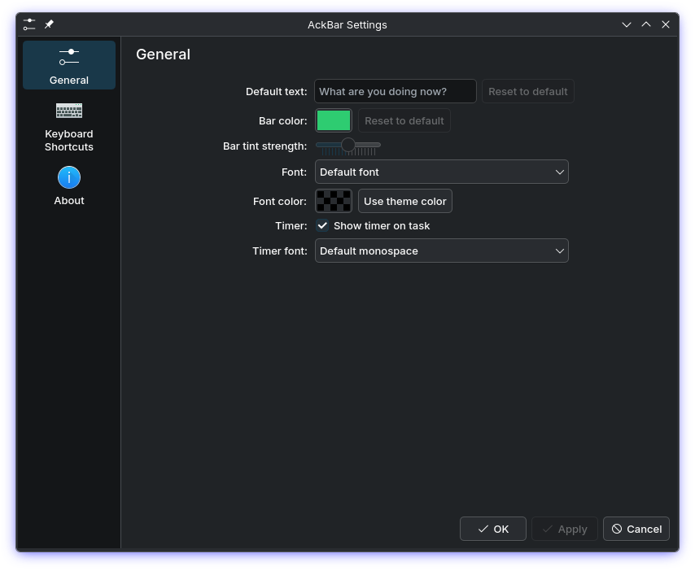

# AckBar

A minimal KDE Plasma 6 panel widget that shows the **one thing you are doing right now** — so you stay on task.

**[Get it on the KDE Store](https://store.kde.org/p/2366085)**



- Empty state: a nearly transparent bar asking *"What are you doing now?"*
- Double-click the bar → a popup where you type your current task
- The bar tints green (color configurable) with your task centered
- An elapsed timer sits at the right edge, so you know how long you've been at it
- Everything survives reboots and plasmashell restarts

## Features

- **One task, always visible** — lives in your panel, no window to lose
- **Elapsed timer** — `MM:SS` (or `H:MM:SS` past an hour), monospace so it doesn't jiggle; resets when the task changes
- **Translucent tint** — your wallpaper shows through; tint strength configurable
- **Configurable** — bar color, tint strength, font face, font color, timer font, timer on/off

## Requirements

- KDE Plasma 6

## Installation

```sh
git clone https://github.com/rodbv/ackbar.git
cd ackbar
./install.sh
systemctl --user restart plasma-plasmashell
```

Then right-click your panel → *Enter Edit Mode* → *Add Widgets…* → search for **AckBar** and drag it onto the panel. Resize it in edit mode to taste.

### Manual install

```sh
kpackagetool6 --type Plasma/Applet --install .   # or --upgrade on updates
```

### Uninstall

```sh
kpackagetool6 --type Plasma/Applet --remove com.rodbv.ackbar
```

## Usage

| Action | Result |
|---|---|
| Double-click the bar | Open the task popup |
| Type + <kbd>Enter</kbd> (or *Set*) | Set the task, start the timer |
| Clear button (✕) | Clear the task |
| <kbd>Esc</kbd> | Close the popup without changes |
| Right-click → *Configure AckBar…* | Colors, fonts, timer settings |

Setting the same text again keeps the timer running; changing the text resets it.





## Development

```sh
./install.sh && systemctl --user restart plasma-plasmashell
```

Widget code is plain QML — no build step:

```
contents/
├── ui/main.qml            # bar (compact) + popup editor (full representation)
├── ui/configGeneral.qml   # settings page
└── config/main.xml        # config schema
```

### Packaging for the KDE Store

Build a distributable `.plasmoid` for upload to [store.kde.org](https://store.kde.org):

```sh
./package.sh   # writes releases/com.rodbv.ackbar-<version>.plasmoid
```

`package.sh` produces a **zip** archive with `metadata.json` and `contents/` at the
root — the only format KDE's package installer and the *Get New Widgets* dialog
accept. A `.tar.gz` renamed to `.plasmoid` fails on install with *"Could not open
package file."* The script aborts if the result isn't a zip or the manifest isn't at
the root.

Release checklist:

1. Bump `"Version"` in `metadata.json`.
2. `./package.sh`, then smoke-test the artifact:
   ```sh
   kpackagetool6 --type Plasma/Applet --install releases/com.rodbv.ackbar-<version>.plasmoid
   ```
3. Upload the `.plasmoid` to the store and set the matching version.

## License

[MIT](LICENSE)

The project logo (`logo.svg`) is the `check_constraint` icon from
[KDE Breeze icons](https://invent.kde.org/frameworks/breeze-icons),
licensed LGPL-3.0-or-later.
