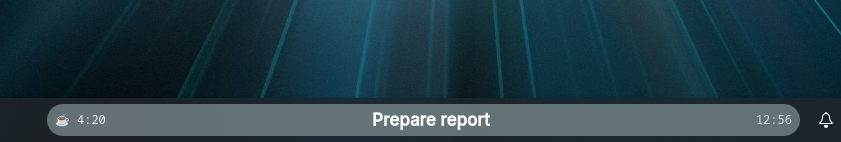
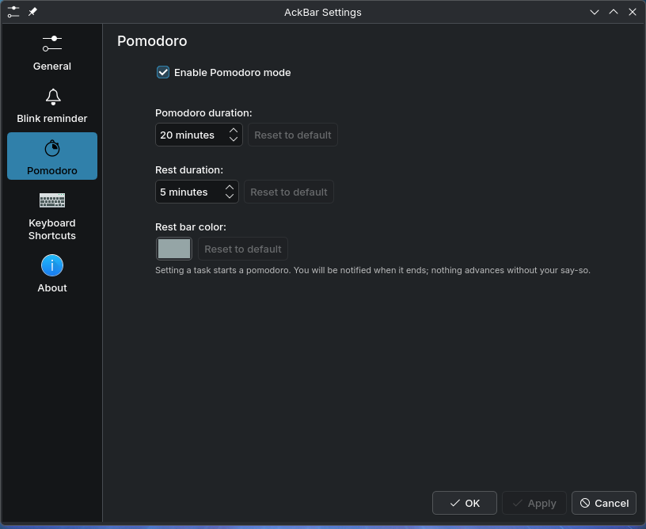

# AckBar

A minimal KDE Plasma 6 panel widget that shows the **one thing you are doing right now** — so you stay on task.

**[Get it on the KDE Store](https://store.kde.org/p/2366085)**


## Features

- **One task, always visible** — lives in your panel, no window to lose. Double-click the bar, type, done. Everything survives reboots and plasmashell restarts.
- **Elapsed timer** — `MM:SS` (or `H:MM:SS` past an hour) at the right edge, monospace so it doesn't jiggle; resets when the task changes.
- **Quiet when idle** — with no task set, the bar is a nearly transparent nudge:

  
- **Blink reminder** — optionally flash the bar in a color of your choice every N minutes, pulling your attention back to the task; off by default, only blinks while a task is set:

  
- **Pomodoro mode** — opt-in, see below.
- **Configurable** — bar color, tint strength, fonts, font color, timer on/off, blink interval and color, pomodoro durations and rest color.

## Pomodoro mode

Off by default; toggle it from the widget's right-click menu. While it's on,
setting a task starts a pomodoro: the bar shows a countdown and session
counter (`🍅x3 12:34`) on the left, next to the usual elapsed timer on the
right.


**Nothing advances without your say-so.** When a pomodoro ends, the bar
flashes and a notification asks what's next — keep working or take a break:


During rest the bar turns gray (color configurable) and counts the break
down:



When the rest is over, another notification lets you snooze it a minute,
start the next pomodoro, or switch to a new task:


Run over the clock and the bar shows the overtime (`🍅x3 25+2:34`).
Changing the task resets the counter and starts fresh; *Rest now* and
*Restart pomodoro* in the right-click menu cover the two common shortcuts.

## Requirements

- KDE Plasma 6

## Installation

```sh
git clone https://github.com/rodbv/ackbar.git
cd ackbar
./install.sh
systemctl --user restart plasma-plasmashell
```

Then right-click your panel → *Enter Edit Mode* → *Add Widgets…* → search for **AckBar** and drag it onto the panel. Resize it in edit mode to taste.

### Manual install

```sh
kpackagetool6 --type Plasma/Applet --install .   # or --upgrade on updates
```

### Uninstall

```sh
kpackagetool6 --type Plasma/Applet --remove com.rodbv.ackbar
```

## Usage

| Action | Result |
|---|---|
| Double-click the bar | Open the task popup |
| Type + <kbd>Enter</kbd> (or *Set*) | Set the task, start the timer |
| Clear button (✕) | Clear the task |
| <kbd>Esc</kbd> | Close the popup without changes |
| Right-click → *Configure AckBar…* | Colors, fonts, timer, blink reminder, pomodoro durations |
| Right-click → *Pomodoro mode* | Toggle pomodoro mode on/off |
| Right-click → *Rest now* / *Restart pomodoro* | Skip ahead / redo the current session (shown while a pomodoro runs) |

Setting the same text again keeps the timer running; changing the text resets it.


## Settings

Settings are split into General, Blink reminder, and Pomodoro pages, with a
*Reset all settings* button on the General page.




## Development

```sh
./install.sh && systemctl --user restart plasma-plasmashell
```

Widget code is plain QML — no build step:

```
contents/
├── ui/main.qml            # bar (compact) + popup editor (full representation)
├── ui/configGeneral.qml   # settings: General page
├── ui/configBlink.qml     # settings: Blink reminder page
├── ui/configPomodoro.qml  # settings: Pomodoro page
├── config/main.xml        # config schema
└── locale/                # compiled translations (.mo)
po/                        # translation sources (.po)
```

After editing a `.po`, recompile before installing:

```sh
msgfmt --check -o contents/locale/pt_BR/LC_MESSAGES/plasma_applet_com.rodbv.ackbar.mo po/pt_BR.po
```

### Packaging for the KDE Store

Build a distributable `.plasmoid` for upload to [store.kde.org](https://store.kde.org):

```sh
./package.sh   # writes releases/com.rodbv.ackbar-<version>.plasmoid
```

`package.sh` produces a **zip** archive with `metadata.json` and `contents/` at the
root — the only format KDE's package installer and the *Get New Widgets* dialog
accept. A `.tar.gz` renamed to `.plasmoid` fails on install with *"Could not open
package file."* The script aborts if the result isn't a zip or the manifest isn't at
the root.

Release checklist:

1. Bump `"Version"` in `metadata.json`.
2. `./package.sh`, then smoke-test the artifact:
   ```sh
   kpackagetool6 --type Plasma/Applet --install releases/com.rodbv.ackbar-<version>.plasmoid
   ```
3. Upload the `.plasmoid` to the store and set the matching version.

## License

[MIT](LICENSE)

The project logo (`logo.svg`) is the `check_constraint` icon from
[KDE Breeze icons](https://invent.kde.org/frameworks/breeze-icons),
licensed LGPL-3.0-or-later.
